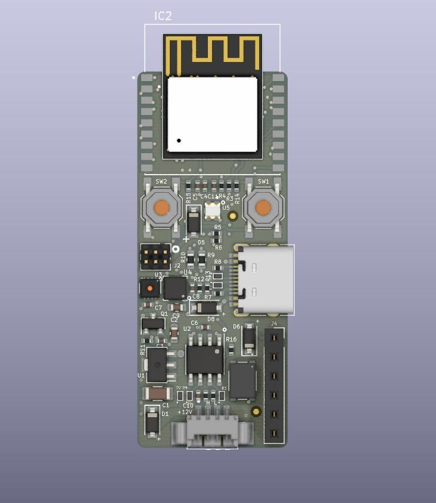

# ESP32C3 CAN BLE V1
Interfacing the ESP32-C3-DevKitM-1 with BM-Lite fingerprint sensor from Fingerprint AB.
> Note: This is the work still in progress. However, the IO configuration, TWAI communication, Serial LED (WS2812C) and temperature sensor work just fine.

### To-Do:
- Accelerometer (LIS3DH) Drivers
- BLE Drivers

## Development - How to get started:
### Software Requirements:
1. Install the ESP-IDF (Espressif IoT Development Framework) from Espressif. Follow the instructions [here](https://docs.espressif.com/projects/esp-idf/en/latest/esp32c3/get-started/index.html#installation-step-by-step).
2. Once the ESP-IDF is setup clone this repository by using git: `git clone --recursive https://github.com/embenix/esp32c3_bmlite.git`
3. Use `idf.py build` to build the project and `idf.py -p COMxx flash monitor` to upload the firmware to the dev-kit. 
> Note: **`xx`** is the number of the COM port on your computer

<!-- ### Hardware Reference:
#### 1. The pinout of the ESP32-C3-DevKitM-1:

 

#### 2. Connection between Fingerprint sensor BM-Lite and ESP32-C3:

| BM-Lite IO Pins      | ESP32-C3 DevKit    |
|:---------------------|:-------------------|
| 01- GND              | GND                |
| 02- SPICLK           | GPIO6              |
| 03- MISO             | GPIO2              |
| 04- MOSI             | GPIO7              |
| 05- CS_N             | GPIO10             |
| 06- IRQ              | GPIO1              |
| 07- RST_N            | GPIO3              |
| 08- UART_RX          | NOT USED           |
| 09- UART_TX          | NOT USED           |
| 10- VDDIO            | 3.3v               | -->

## Hardware:
### Schematic
1. [ESP32C3_CAN-BLE_unit_v1](./documents/ESP32C3_CAN-BLE_unit_v1.pdf "ESP32C3_CAN-BLE_unit_v1")

